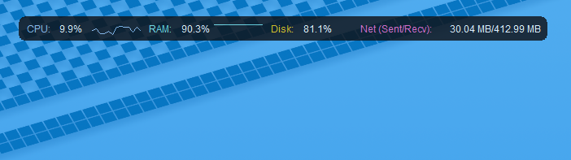

# System Monitor Overlay

A Python application that displays an overlay with system information such as CPU, RAM, Disk, and Network usage at the top of your screen.



## Installation

1. **Clone the repository:**

   ```sh
   git clone https://github.com/EvickaStudio/system_monitor.git
   cd system_monitor
   ```

2. **Create and activate a virtual environment:**

   On macOS and Linux:
   ```sh
   python -m venv venv
   source venv/bin/activate
   ```

   On Windows:
   ```sh
   python -m venv venv
   venv\Scripts\activate
   ```

3. **Install the dependencies:**

   ```sh
   pip install -r requirements.txt
   ```

## Usage

Run the application:

```sh
python -m system_monitor.main
```

## Running Tests

To run the unit tests, use the following command:

```sh
python -m unittest discover tests
```

## Screenshots


## License

This project is licensed under the terms of the GNU General Public License v3.0. See the [`LICENSE`](LICENSE) file for details.